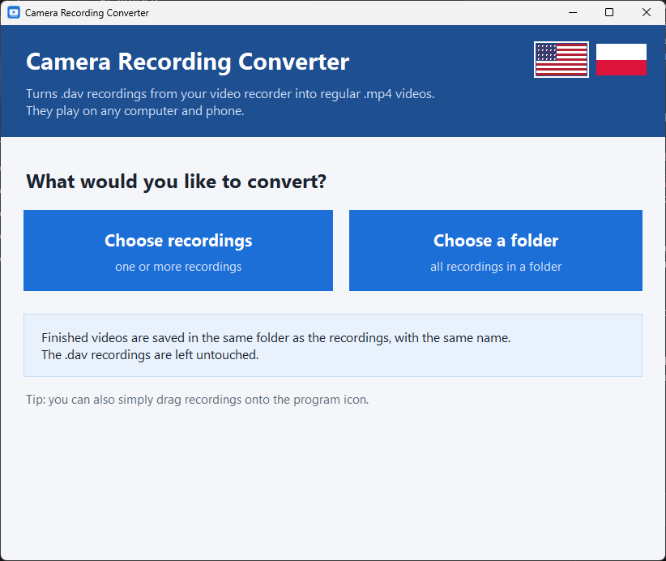
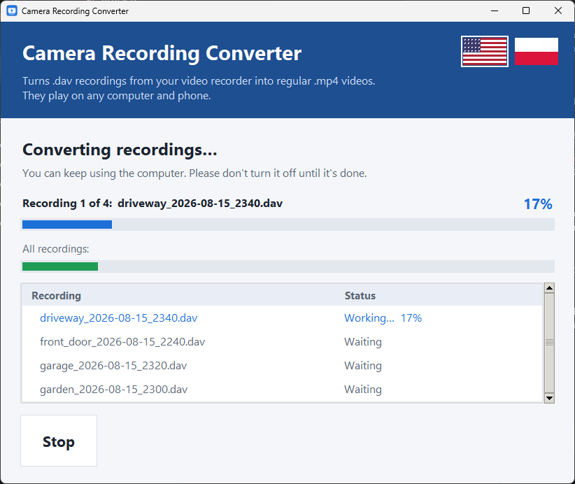
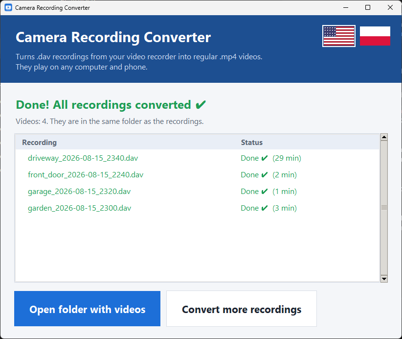

# ConverterDAVtoMP4

A simple, portable Windows program that turns **.dav recordings from CCTV video recorders (DVR/NVR)** into
regular **.mp4 videos** that play on any computer, TV or phone.

It was made to be easy for everyone – including people who don't use computers much: two big buttons,
clear progress bars, no settings to get wrong.

### ⬇️ [Download ConverterDAVtoMP4.exe](https://github.com/Oui42/ConverterDAVtoMP4/releases/latest/download/ConverterDAVtoMP4.exe)

One file, no installation, works offline. Windows 10/11 (64-bit).



## Features

- **One portable .exe** – nothing to install, nothing is written next to the program. FFmpeg is built in.
- **No quality loss** – the video is repackaged into MP4, not re-encoded, so it is also very fast
  (a 1 GB / 1 hour recording takes a few seconds).
- **Whole folders at once** – subfolders included; each video is saved next to its recording with the same name.
- **Clear progress** – progress bar for the current recording and for all of them, time left, status of each file.
- **Correct playback speed** – real frame timestamps are kept (recorders often record at a variable frame rate),
  and known timestamp glitches of the recorder are repaired, so the video matches the clock burned into the image.
- **Safe** – the original .dav files are never changed; recordings that were already converted are skipped;
  stopping or closing never leaves a broken, half-written MP4; the MP4 gets the date of the recording.
- **English and Polish** – starts in Polish on a Polish Windows, in English otherwise; switch any time with
  the flag buttons in the top-right corner (the choice is remembered).

| Converting | Done |
|---|---|
|  |  |

## How to use

1. Download [ConverterDAVtoMP4.exe](https://github.com/Oui42/ConverterDAVtoMP4/releases/latest/download/ConverterDAVtoMP4.exe)
   and double-click it.
2. Click **Choose recordings** (one or more .dav files) or **Choose a folder** (all .dav files in it).
   You can also drag recordings or a folder onto the program icon.
3. Wait until you see **Done!** and click **Open folder with videos**.

> **"Windows protected your PC"?** The program is not digitally signed (a code-signing certificate is paid),
> so Windows SmartScreen or an antivirus may warn about it the first time. Click **More info → Run anyway**.
> You can check the source code in this repository and build the program yourself (see below).

## Supported recordings

"DAV" is not a single format – different recorder brands write different files with the same extension.

| Recorder / file | How it is converted | Status |
|---|---|---|
| **JUAN / JuFeng** recorders (file starts with the `JUFEN` header), H.264 and H.265 video | built-in reader, repackaged to MP4 without re-encoding | tested with real recordings |
| **Dahua** and other .dav files that FFmpeg can read | repackaged with FFmpeg (audio converted to AAC); if that fails, re-encoded to H.264 | should work – not yet tested with real Dahua recordings |

H.265 videos play in VLC and most modern players. The built-in Windows "Films & TV" / "Media Player" app needs
the free *HEVC Video Extensions* from the Microsoft Store to play H.265.

If a recording cannot be converted, the program marks it in red and explains why. Please
[open an issue](https://github.com/Oui42/ConverterDAVtoMP4/issues) and mention your recorder brand/model –
support for more formats can be added.

## Command line

The converter can also be used without the window (Python version):

```
python converter.py recording.dav
python converter.py "D:\Recordings"
```

## Building from source

Requirements: Windows, [Python 3.10+](https://www.python.org/downloads/).

```
build.bat
```

The script creates a virtual environment, installs [imageio-ffmpeg](https://github.com/imageio/imageio-ffmpeg)
(for `ffmpeg.exe`) and [PyInstaller](https://pyinstaller.org), and builds `dist\ConverterDAVtoMP4.exe`.
To run the program without building: `pip install imageio-ffmpeg` and `python app.py`.

| File | Purpose |
|---|---|
| `app.py` | the window (Tkinter), texts in English and Polish |
| `converter.py` | the conversion: JUFEN reader + MPEG-TS repackaging, FFmpeg for other formats |
| `build.bat` | builds the portable .exe |
| `app.ico`, `splash.png` | icon and start-up screen |

Settings (only the chosen language) are stored in `%APPDATA%\ConverterDAVtoMP4\settings.json`.

## License

The source code is released under the [MIT License](LICENSE).
The portable .exe contains FFmpeg, licensed under the GNU GPL version 3 – see
[THIRD-PARTY-NOTICES.md](THIRD-PARTY-NOTICES.md).

## Support

ConverterDAVtoMP4 is free and made in spare time. If it saves you work, you can buy me a coffee: https://buymeacoffee.com/oui42
